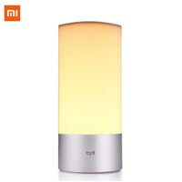

# Home Assistant custom component for Yeelight Bedside lamp

This is a custom component for Home Assistant that allows the control of the Yeelight bedside Lamp via bluetooth. (Contrary to the wifi version, those lamps only have bluetooth control).



Originally based on the work by Teemu Rytilahti [python-yeelightbt](https://github.com/rytilahti/python-yeelightbt), it has been completely re-written to improve stability and only focuses on the integration with HA.


# Installation

This custom component can be installed in two different ways: `manually` or `using HACS`

## 1. Manual Installation

1. Download the `hass-yeelight_bt.zip` file from the
   [latest release](https://github.com/hcoohb/hass-yeelightbt/releases/latest).
2. Unpack the release and copy the `custom_components/yeelight_bt` directory
   into the `custom_components` directory of your Home Assistant
   installation.
3. install bluepy in the HA virtual environment
4. Add the `yeelight_bt` lights as described in next section.


## 2. Installation using HACS

This repo is now in hacs, so just search for it, install and enjoy automatic updates.

## Give bluetooth permissions for device scanning !

This component use the `bluepy` python library to access bluetooth. In order to scan for new devices, it needs to have the correct permissions:
  - For Home-assistant core installed in Virtualenv:

    ```
    sudo setcap cap_net_admin,cap_net_raw+eip /PATH-TO-HA-VENV/PATH-TO-BLUEPY-LIB/bluepy-helper
    ```

  - For Home-assistant core in docker:

    The docker-compose (or equivalent docker command) should have:

    ```yaml
    cap_add:
     - NET_ADMIN
     - NET_RAW
    network_mode: host
    ```

  - for HASSIO:

    Not too sure yet... It may have the correct permissions already ??

# Homeassistant component configuration

The devices can be configured either through the `integration menu` or the `configuration.yaml` file. 

## 1. Using the integrations menu

In Configuration/Integrations click on the + button, select `Yeelight bluetooth` and configure the name and mac address on the form.
The light is automatically added and a device is created.


## 2. Using configuration.yaml

1. For each lamp, create a light with the `yeelight_bt` platform and configure the `name` and `mac` address.
    
    Example:
    ```yaml
    light:
      - platform: yeelight_bt
        name: Bedside lamp
        mac: 'f8:24:41:xx:xx:xx'
      - platform: yeelight_bt
        name: Other lamp
        mac: 'f8:24:41:xx:xx:xx'
    ```

2. Restart Home Assistant.

## Light pairing

1. If the light has been paired with a previous device prior, best to reset it following [this youtube video](https://www.youtube.com/watch?v=PnjcOSgnbAM)
2. The custom component will automatically request a pairing with the lamp if it needs to. When the pairing request is sent, the light will pulse. You then need to push the little button at the top of the lamp.  
Once paired you can control the lamp through HA


# TODO

- [x] Re-implement bluetooth backend for stability and optimal responsivness for yeelight
- [x] Add component to HACS for easy install
- [x] Allow configuration through the integration UI
- [ ] Enable discovery of lamps in UI? (Not sure if possible)
- [ ] Look into setting up effect and flow (low priority)
- [x] Allow pairing process with new device
- [ ] Support for candela light? (I do not have a device, so might need help from someone with one...)
- [x] Scale temperature range so that it matches HA UI

# Debugging

In order to getmore information on what is going on, the debugging flag can be enabled by placing in the `configuration.yaml` of Home assistant:

```yaml
logger:
  default: error
  logs:
    custom_components.yeelight_bt: debug
```

NOTE: this will generate A LOT of debugging messages in the logs, so it is not recommended to use for a long time